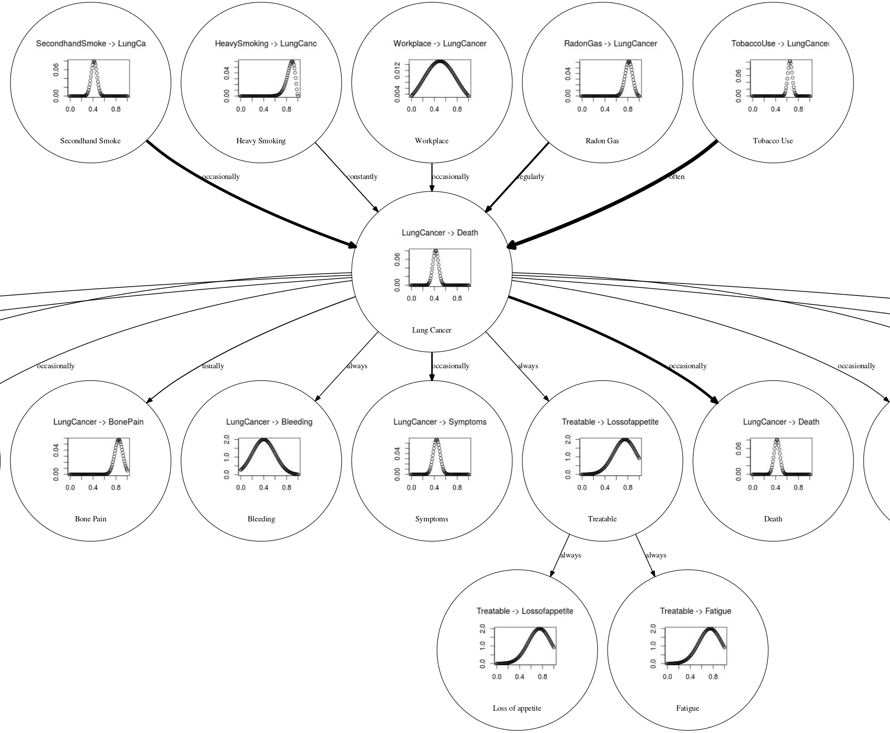

* Email: eduardo [pattern1] garrido [pattern2] uam [pattern1] es
* [CV](./files/CV.pdf) | [Google Scholar profile](https://scholar.google.es/citations?user=CjCcb90AAAAJ) | [Github profile](https://github.com/EduardoGarrido90) | [arXiv page](https://arxiv.org/a/garridomerchan_e_1.html)

Thanks a lot for coming and welcome to my web page! I am 
**Eduardo C. Garrido Merchán**, a research scientist currently working as a Teacher Assistant @[**UAM**](http://www.uam.es/) on artificial intelligence and studying a Machine Learning PhD (mainly focused in **Bayesian Optimization**) at the [**Machine Learning group**](http://arantxa.ii.uam.es/~gaa/publications.html). I am currently PhD candidate and hope to defend this summer!

About me: I enjoy a lot to spend time with my wife and kids and to read, mostly philosophy (mostly metaphysics, ethics and religion), artificial intelligence, scientific stuff and classics. I also like to debate about trascendental (and more terrenal) questions and to think about them. My research activities include Bayesian optimization, Gaussian processes, 
probabilistic machine learning, causality and machine consciousness. I am also informed about natural language processing and 
machine learning in general, as I am a very curious person.

Please, do not hesitate to send me an email if you want to discuss any topic or to get in touch. I like a lot to meet new people with common interests. 

* * *

# Research

## Bayesian Optimization

This is my main area of research. 
With Bayesian Optimization we can auto-tune any machine learning 
algorithm. Furthermore, we can even perform automatic machine learning 
or optimize real industrial applications. Have you ever dream on 
pressing a red button and getting the perfect configuration for an 
algorithm or process without even thinking about how it works? Here is 
your solution. My work resides in expansions of the Bayesian 
Optimization framework. Main papers:
* Garrido-Merchán, E. C. and Hernández-Lobato, D. *Dealing with categorical and integer-valued variables in Bayesian optimization with Gaussian processes*. **Neurocomputing**, 380:20-35, 2020. [URL](https://doi.org/10.1016/j.neucom.2019.11.004)
* Garrido-Merchán, E.C. and Hernández-Lobato, D. *Predictive Entropy Search for Multi-objective Bayesian Optimization with Constraints*. **Neurocomputing**, 361:50-68, 2019. [URL](https://doi.org/10.1016/j.neucom.2019.06.025)

## Gaussian processes

Bayesian Optimization uses Probabilistic Models in order to work. Gaussian Processes are an example. There are 
lots of stochastic processes that serve as priors over functions. These 
are like probability distributions that serve as priors over data, but 
for functions. These are very useful and beautiful to study models. My 
work resides on expanding Gaussian Processes to different scenarios. 
Main papers:
* Garrido-Merchán, E. C. and Hernández-Lobato, D. *Dealing with categorical and integer-valued variables in Bayesian optimization with Gaussian processes*. **Neurocomputing**, 380:20-35, 2020. [URL](https://doi.org/10.1016/j.neucom.2019.11.004)
* Villacampa, C., Zaldivar, B., Garrido-Merchán, E. C. and Hernández-Lobato, D. *Multi-class Gaussian Process Classification with Noisy Inputs*. **Journal of Machine Learning Research**, 22(36):1-52, 2021. [URL](https://jmlr.csail.mit.edu/papers/v22/20-107.html)

## Causality

Correlations are not the only important thing in 
machine learning. I can push a train when it starts moving and retain it
 when it stops. My movements are correlated with those of the train 
but... the train stops moving because of my actions? Although there is 
correlation there is not causation. Causation is important. I study 
different ways to represent causation using graphs. Main papers:
* Sobrino, A., Garrido-Merchán, E. C. and Puente, C. *Fuzzy Stochastic Timed Petri Nets for Causal Properties Representation*. **Journal of New Mathematics and Natural Computation**, accepted, 2021. [URL](https://doi.org/10.1142/S1793005721500320)
* Puente, C., Sobrino, A., Olivas, J. A. and Garrido, E. *Summarizing information by means of causal sentences through causal graphs*. **Journal of Applied Logic**, 24(B):3-14. [URL](https://doi.org/10.1016/j.jal.2016.11.020)
* Garrido-Merchán, E. C., Puente, C. and Palacios, R. *Fake News Detection by Means of Uncertainty Weighted Causal Graphs*. **Lecture Notes in Artificial Intelligence (HAIS 2020)**, 12344:13-24, 2020. [URL](https://doi.org/10.1007/978-3-030-61705-9_2)

## Machine consciousness

This is personal research but I consider 
to know as much about this as from my other research. Consciousness is a topic that lies in 
the borderline of the scientific method, but now even Yoshua Bengio 
studies it. It is an interdisciplinary area targeted as well by brain 
inspired AI. Philosophy of Mind has worked in this topic for quite a 
long time. Neuroscientist are also working a lot here. It is quite challenging to write about this topic but as I study lots of philosophy I think that I can also contribute to this field as an interdisciplinary computer science philosopher. 
* Garrido-Merchán, E. C. and Molina, M. *A Machine Consciousness Architecture Based on Deep Learning and Gaussian Processes*. **Lecture Notes in Artificial Intelligence (HAIS 2021)**, 12344:350-361, 2021. [URL](https://doi.org/10.1007/978-3-030-61705-9_29)

* * *

# Teaching

## Laboratory/practical at Universidad Autonoma de Madrid
* 2021: Artificial Intelligence. (3 final degree thesis)
* 2018-2020: Artificial Intelligence. Compilers. (1 final degree thesis)
* 2018: Databases. (2 final degree thesis)
* 2017-2018: Artificial Intelligence and Operative Systems. Directed three final degree thesis about optimization in arts. (Cooking, music and images)
* 2016-2017: Operative Systems.

## Data Science courses
* Msc of Data Science at Universidad de Alcalá: Tools of Data science: R and Tidyverse course.
* REALE insurances: Deep Learning and Ensembles course. Theory and practice.

* * *

# Publications
## Preprints
*	Garrido-Merchán, E.C. and Hernández-Lobato, D. *Parallel Predictive Entropy Search for Multi-objective Bayesian Optimization with Constraints*. [URL](https://arxiv.org/abs/2004.00601)
*	Garrido-Merchán, E.C., Puente, C., Sobrino, A. and Olivas, J. A. *Uncertainty Weighted Causal Graphs*. [URL](https://arxiv.org/abs/2002.00429)
*	Garrido-Merchán, E.C., Molina, M. and Mendoza, F. M. *An Artificial Consciousness Model and its relations with Philosophy of Mind*. Under review, 2021. [URL](https://arxiv.org/abs/2011.14475)

## Refereed Journals
* Balázs, Csaba, et al. *A comparison of optimisation algorithms for high-dimensional particle and astrophysics applications*. **Journal of High Energy Physics**, accepted, 2021. [URL](https://arxiv.org/abs/2101.04525)
* Sobrino, A., Garrido-Merchán, E. C. and Puente, C. *Fuzzy Stochastic Timed Petri Nets for Causal Properties Representation*. **Journal of New Mathematics and Natural Computation**, accepted, 2021. [URL](https://doi.org/10.1142/S1793005721500320)
Villacampa, C., Zaldivar, B., Garrido-Merchán, E. C. and Hernández-Lobato, D. *Multi-class Gaussian Process Classification with Noisy Inputs*. **Journal of Machine Learning Research**, 22(36):1-52, 2021. [URL](https://jmlr.csail.mit.edu/papers/v22/20-107.html)
* Garrido-Merchán, E. C. and Hernández-Lobato, D.	*Dealing with categorical and integer-valued variables in Bayesian optimization with Gaussian processes*. **Neurocomputing**, 380:20-35, 2020. [URL](https://doi.org/10.1016/j.neucom.2019.11.004)
* Garrido-Merchán, E.C. and Hernández-Lobato, D. *Predictive Entropy Search for Multi-objective Bayesian Optimization with Constraints*. **Neurocomputing**, 361:50-68, 2019. [URL](https://doi.org/10.1016/j.neucom.2019.06.025)
* Cornejo-Bueno, L., Garrido-Merchán, E. C., Hernández-Lobato, D. and Salcedo-Sanz, S. *Bayesian optimization of a hybrid system for robust ocean wave features prediction*. **Neurocomputing**, 275:818-828, 2018. [URL](https://doi.org/10.1016/j.neucom.2017.09.025)
* Puente, C., Sobrino, A., Olivas, J. A. and Garrido, E. *Summarizing information by means of causal sentences through causal graphs*. **Journal of Applied Logic**, 24(B):3-14, 2017. [URL](https://doi.org/10.1016/j.jal.2016.11.020)

## Conferences
* Garrido-Merchán, E. C. *Transhumanismo y Consciencia Fenoménica*. **Congreso Razón Abierta**, accepted, 2021.
* Asencio-Martín, L. and Garrido-Merchán, E. C.	*A Similarity Measure of Gaussian Process Predictive Distributions*. **Lecture Notes in Artificial Intelligence (CAEPIA 2021)**, accepted, 2021. [URL](https://arxiv.org/abs/2101.08061)
* Jariego-Pérez, L. C. and Garrido-Merchán, E. C.	*Towards Automatic Bayesian Optimization: A first step involving acquisition functions*. **Lecture Notes in Artificial Intelligence (CAEPIA 2021)**, accepted, 2021. [URL](https://arxiv.org/abs/2003.09643)
* González-Carvajal, S. and Garrido-Merchán, E. C. *Comparing BERT against traditional machine learning text classification*.	**Proceedings of the XIX Conferencia de la Asociación Española para la Inteligencia Artificial (CAEPIA 2021)**, accepted, 2021.	[URL](https://arxiv.org/abs/2005.13012)
* Garrido-Merchán, E. C. and Molina, M. *A Machine Consciousness Architecture Based on Deep Learning and Gaussian Processes*.	**Lecture Notes in Artificial Intelligence (HAIS 2020)**, 12344:350-361, 2020. [URL](https://doi.org/10.1007/978-3-030-61705-9_29)
* Garrido-Merchán, E. C., Puente, C. and Palacios, R. *Fake News Detection by Means of Uncertainty Weighted Causal Graphs*. **Lecture Notes in Artificial Intelligence (HAIS 2020)**, 12344:13-24, 2020. [URL](https://doi.org/10.1007/978-3-030-61705-9_2)
* Garrido-Merchán, E. C., Puente C. and Olivas, J. A. *Generating a Question Answering System from Text Causal Relations*. **Lecture Notes in Artificial Intelligence (HAIS 2019)**, 11734:14-25, Springer, 2019. [URL](https://doi.org/10.1007/978-3-030-29859-3_2)
* Garrido-Merchán, E. C. and Albarca-Molina, A. *Suggesting Cooking Recipes Through Simulation and Bayesian Optimization*. **Lecture Notes in Computer Science (IDEAL 2018)**, 11314:117-124, 2018. [URL](https://doi.org/10.1007/978-3-030-03493-1_30)
* Córdoba, I., Garrido-Merchán, E. C., Hernández-Lobato, D., Bielza, C. and Larrañaga, P. *Bayesian Optimization of the PC Algorithm for Learning Gaussian Bayesian Networks*. **Lecture Notes in Artificial Intelligence (CAEPIA 2018)**, 11160:44-54, 2018. [URL](https://doi.org/10.1007/978-3-030-00374-6_5)
* Cornejo-Bueno, L., Garrido-Merchán, E. C., Hernández-Lobato, D. and Salcedo-Sanz, S. *Bayesian Optimization of a Hybrid Prediction System for Optimal Wave Energy Estimation Problems*. **Lecture Notes in Computer Science (IWANN 2017)**, 10305:648-660, Springer, 2017. [URL](https://doi.org/10.1007/978-3-319-59153-7_56)
* Puente, C., Sobrino, A., Garrido, E. and Olivas, J. A. *Summarizing Information by Means of Causal Sentences Through Causal Questions*. **Advances in Intelligent Systems and Computing**, 368:353-363, Springer, 2015. [URL](https://doi.org/10.1007/978-3-319-19719-7_31)
* Puente, C., Garrido, E. and Olivas, J. A. *Answering Questions by Means of Causal Sentences*. **Lecture Notes in Artificial Intelligence (FQAS 2013)**, 8132:91-99, Springer, 2013. [URL](https://doi.org/10.1007/978-3-642-40769-7_8)
* Puente, C., Olivas, J. A., Garrido, E. and Seisdedos, R. *Compressing the representation of a causal graph*. **Proceedings of the 2013 Joint IFSA World Congress and NAFIPS Annual Meeting (IFSA/NAFIPS)**, 122-127, IEEE, 2013. [URL](https://doi.org/10.1109/IFSA-NAFIPS.2013.6608386)
* Puente, C., Olivas, J. A., Garrido, E. and Seisdedos, R. *Creating a natural language summary from a compressed causal graph*. **Proceedings of the 2013 Joint IFSA World Congress and NAFIPS Annual Meeting (IFSA/NAFIPS)**, 513-518, IEEE, 2013. [URL](https://doi.org/10.1109/IFSA-NAFIPS.2013.6608453)

* * *

# Code 

Here are some links to my public code on Github or to codes where I have collaborated, I have a lot more of private repos, soon they will be available!
* Branch of Spearmint Bayesian optimization tool with my Bayesian optimization methods (not all!) [URL](https://github.com/EduardoGarrido90/Spearmint)
* Bayesian optimization of the Bayesian Networks PC algorithm: [URL](https://github.com/EduardoGarrido90/bopc)
* Probabilistic causal graphs (PCGs) Python-Prolog implementation, causal relations engine and fake news classifier based in PCGs [URL](https://github.com/EduardoGarrido90/omnius)
* Multi-class Gaussian Process Classification with Noisy Inputs [URL](https://github.com/EduardoGarrido90/GPInputNoise)
* Framework for the high-dimensional sampling challenge of DarkMachines.org [URL](https://github.com/DarkMachines/high-dimensional-sampling)

* * *

# Workshop abstracts and posters

* Jariego-Pérez, L. C. and Garrido-Merchán E. C. *Heuristic Bayesian Optimization*.	**Bayesian Inference In Stochastic Processes**, Real Academia de Ciencias Exactas, Físicas y Naturales, Madrid, 2019.
* Garrido Merchán, E. C. and Hernández-Lobato, D. *Parallel Predictive Entropy Search for Multiobjective Optimization with Constraints*. **Bayesian Inference In Stochastic Processes**, Real Academia de Ciencias Exactas, Físicas y Naturales, Madrid, 2019.
* Garrido Merchán, E. C., Zaldívar, B. and Hernández-Lobato, D. *A Gaussian Process Model for Multi-class Classification with Noisy Inputs*. **Bayesian Inference In Stochastic Processes**, Real Academia de Ciencias Exactas, Físicas y Naturales, Madrid, 2019.
* Garrido-Merchán, E. C. and Hernández Lobato, D. *Dealing with Integer and Categorical-valued Variables in Bayesian Optimization with Gaussian Processes*. **AutoML workshop at ICML**, Stockholmsmässan, Stockholm, 2018.
* Córdoba, I., Garrido-Merchán, E. C., Hernández-Lobato, D., Bielza, C. and Larrañaga, P. *Bayesian optimization of the PC algorithm for learning Gaussian Bayesian networks*. **Machine Learning Summer School**, Universidad Autónoma de Madrid, Madrid, 2018.
* Garrido-Merchán, E. C., Hernández-Lobato, D. *Dealing with Integer-valued Variables in Bayesian Optimization with Gaussian Processes*. **AutoML workshop at ICML**, International Convention Centre, Sydney, 2017.
* Garrido-Merchán, E. C. *Information based approaches for Bayesian optimization*. **Advances and applications of data science and engineering**, Real Academia de Ingeniería, Madrid, 2016.
* Garrido-Merchán, E. C. and Hernández-Lobato, D. *Predictive Entropy Search for Multi-objective Bayesian Optimization with Constraints*. **BayesOpt workshop at NeurIPS**, Centro de Convenciones Internacionales, Barcelona, 2016.

* * *

# Other
## Reviewer

AAAI (2020, 2021), UAI (2019, 2020), ECML (2020), ICML (2019 - <i>Top Reviewer</i>), 
ICLR (2019, 2021), NeurIPS (2018, 2019 - <i>Top Reviewer</i>, 2020), ACM Computing Surveys, AISTATS (2018, 2021), AutoML (2018, 2019, 2020), BayesOpt (2017)

## Education
* **Gaussian Process Summer School** 2020.
* **Machine Learning Summer School** 2018, Volunteer and Co-organizer

* * *

# Personal

## Literature recommendations
Some scifi narrative that you may like:
* **Olaf Stapledon**: Star Maker, The First and Last Men, Weird John. 
* **Greg Egan**: Hard scifi. Schild ladder, Quarantine.
* **Liu Cixin**: The Three Body Problem trilogy, specially the last one: Death's End.
* **H.P. Lovecraft**: Complete narrative. Master of cosmic terror.
* **Arthur C. Clarke**: Childhood's end, 2001: A space oddysey and all the books in the saga, The city and the stars, Rendezvous with Rama. Like Olaf Stapledon, but more commercial.
* **Stephen Baxter**: Manifold Time, Manifold Space. Arthur C. Clarke of the 21th century.
* **Frank Herbert**: Destination Void, The prequels of Dune. Brilliant.
* **Isaac Asimov**: The Last Question, The Last Answer, Foundation Saga. (Specially the Second Foundation!) A classic.
* **Andy Weir**: The Egg (Only five pages, give it a try!). Spinoza's God in a tale.

## Videogames recommendations
I specially enjoy RPGs amongst the rest of videogames, these are my favourites, ordered:
* **Xenoblade Chronicles definitive edition** Nintendo Switch. Brilliant plot, philosophical references to Nietzsche.
* **Chronno Trigger** SNES. Outstanding history, covering all the ages. The main character reflects Jesus of Nazareth.
* **Lufia II** SNES. Most romantic ending ever seen in a videogame.
* **Terranigma** SNES. 
I also used to play a lot to **Age of Empires II** when I was young.

## Philosophy recommendations
I love philosophy since I was a kid. Hence, I have read quite a lot. In particular, I like philosophy of mind, science, of religion, metaphysics and ethics. Here are some recommendations:
* **History of philosophy** I recommend Reale's books for a quick tour and Copleston books for a more detailed tour. Fraile's book are quite good for the antique and medieval world. 
* **Ethics** Catholic values are great to build a better world. Even if you do not believe, reading (without prejudice for the non-believers) the Bible and in particular The New Testament can be quite an experience. Just give it a try.
* **Faith and reason** All the debates of medieval times are quite interesting. Concretely, Saint Augustine times are very interesting to read. I also recommend actual debates for example of William Lane Craig.
* **Mind** Philosophy of mind is such an amazing field. Debates of David Chalmers vs Daniel Dennett are quite interesting. The conversation is about the hard problem of consciousness.
* **Metaphysics and the ancient world** Here, I recommend to start with the presocratics, Plato and Aristotle.

I prefer to keep my views, beliefs and opinions about these topics private. But do not hesitate in debating with me any philosophical, political or religious topic, I will be delighted to do so!
